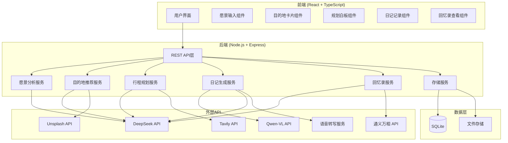
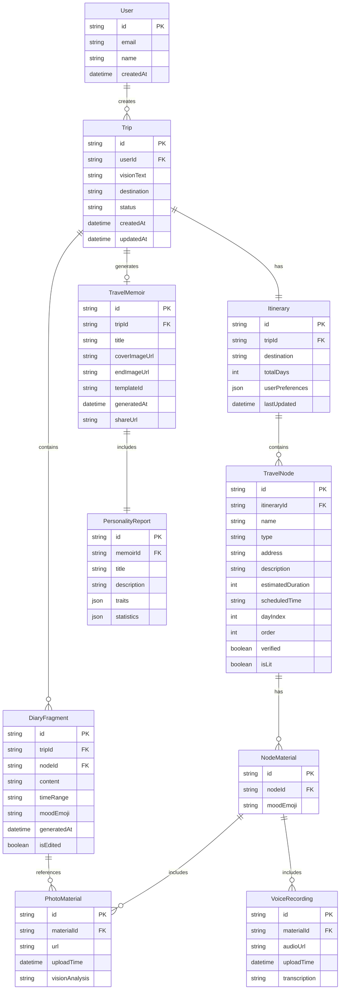

# Design Document

## Overview

AI旅行规划+日记系统采用前后端分离架构，前端使用React + TypeScript构建SPA应用，后端使用Node.js + Express提供RESTful API。系统集成多个AI服务（DeepSeek、Qwen-VL、通义万相）和第三方API（Unsplash、Tavily）实现智能规划与内容生成。数据持久化使用SQLite（MVP阶段），便于快速开发和GitHub部署。

## Architecture



## Components and Interfaces

### 1. 愿景分析服务 (VisionService)

```typescript
interface VisionInput {
  text: string;           // 用户输入的愿景描述
  userId: string;         // 用户ID
}

interface SearchConditions {
  geographicFeatures: string[];   // 地理特征 ["雪山", "森林"]
  climatePreference: string;      // 气候偏好 "温暖"
  foodPreferences: string[];      // 美食需求 ["米线"]
  activityTypes: string[];        // 活动类型 ["观光", "美食"]
  budgetLevel?: string;           // 预算级别
  travelStyle?: string;           // 旅行风格
}

interface VisionAnalysisResult {
  success: boolean;
  conditions: SearchConditions;
  rawAnalysis: string;            // DeepSeek原始分析结果
  errorMessage?: string;
}

class VisionService {
  async analyzeVision(input: VisionInput): Promise<VisionAnalysisResult>;
}
```

### 2. 目的地推荐服务 (DestinationService)

```typescript
interface DestinationCard {
  id: string;
  cityName: string;               // 城市名称
  province: string;               // 省份
  coverImageUrl: string;          // Unsplash封面图URL
  recommendReason: string;        // 推荐理由
  hotSpots: string[];             // 热门景点标签
  matchScore: number;             // 匹配度分数 0-100
}

interface DestinationRecommendation {
  success: boolean;
  destinations: DestinationCard[];
  excludedCities: string[];       // 已排除的城市（用于换一批）
  errorMessage?: string;
}

class DestinationService {
  async recommendDestinations(
    conditions: SearchConditions,
    excludedCities?: string[]
  ): Promise<DestinationRecommendation>;
  
  async fetchCoverImage(cityName: string): Promise<string>;
}
```

### 3. 行程规划服务 (ItineraryService)

```typescript
interface TravelNode {
  id: string;
  name: string;                   // 景点/餐厅名称
  type: 'attraction' | 'restaurant' | 'hotel' | 'transport';
  address: string;
  description: string;
  estimatedDuration: number;      // 预计停留时间（分钟）
  scheduledTime: string;          // 计划时间
  dayIndex: number;               // 第几天
  order: number;                  // 当天顺序
  verified: boolean;              // Tavily验证状态
  verificationInfo?: string;      // 验证信息
}

interface Itinerary {
  id: string;
  tripId: string;
  destination: string;
  totalDays: number;
  nodes: TravelNode[];
  userPreferences: string[];      // 用户偏好记录
  lastUpdated: Date;
}

interface ChatMessage {
  role: 'user' | 'assistant';
  content: string;
  timestamp: Date;
}

class ItineraryService {
  async generateItinerary(
    destination: string,
    conditions: SearchConditions,
    days: number
  ): Promise<Itinerary>;
  
  async updateWithPreference(
    itinerary: Itinerary,
    userMessage: string,
    chatHistory: ChatMessage[]
  ): Promise<{ itinerary: Itinerary; response: string }>;
  
  async verifyNode(node: TravelNode): Promise<TravelNode>;
  
  async manualUpdateNode(
    itineraryId: string,
    nodeId: string,
    updates: Partial<TravelNode>
  ): Promise<TravelNode>;
}
```

### 4. 日记生成服务 (DiaryService)

```typescript
interface NodeMaterial {
  nodeId: string;
  photos: PhotoMaterial[];
  voiceRecordings: VoiceRecording[];
  moodEmoji?: string;
}

interface PhotoMaterial {
  id: string;
  url: string;
  uploadTime: Date;
  visionAnalysis?: string;        // Qwen-VL分析结果
}

interface VoiceRecording {
  id: string;
  audioUrl: string;
  uploadTime: Date;
  transcription?: string;         // 语音转写文本
}

interface DiaryFragment {
  id: string;
  nodeId: string;
  nodeName: string;
  content: string;                // 生成的日记文本（约100字）
  photos: PhotoMaterial[];
  timeRange: string;              // 时间段描述
  moodEmoji?: string;
  generatedAt: Date;
  isEdited: boolean;
}

class DiaryService {
  async uploadPhoto(
    nodeId: string,
    file: Buffer,
    mimeType: string
  ): Promise<PhotoMaterial>;
  
  async uploadVoice(
    nodeId: string,
    file: Buffer
  ): Promise<VoiceRecording>;
  
  async transcribeVoice(recording: VoiceRecording): Promise<string>;
  
  async analyzePhoto(photo: PhotoMaterial): Promise<string>;
  
  async generateDiaryFragment(
    node: TravelNode,
    materials: NodeMaterial
  ): Promise<DiaryFragment>;
  
  async updateFragment(
    fragmentId: string,
    content: string
  ): Promise<DiaryFragment>;
}
```

### 5. 回忆录服务 (MemoirService)

```typescript
interface PersonalityReport {
  title: string;                  // 如 "雪山仰望者"
  description: string;            // 人格描述
  traits: string[];               // 特征标签
  statistics: TripStatistics;
}

interface TripStatistics {
  totalDays: number;
  totalNodes: number;
  totalPhotos: number;
  topMoods: string[];
  highlightMoments: string[];
}

interface MemoirTemplate {
  id: string;
  name: string;                   // "日系小清新" | "复古牛皮纸" | "极简黑白"
  cssClass: string;
  previewUrl: string;
}

interface TravelMemoir {
  id: string;
  tripId: string;
  title: string;
  coverImageUrl: string;          // 通义万相生成的封面
  endImageUrl: string;            // 通义万相生成的尾图
  fragments: DiaryFragment[];
  personalityReport: PersonalityReport;
  templateId: string;
  generatedAt: Date;
  shareUrl?: string;
}

class MemoirService {
  async generateMemoir(tripId: string): Promise<TravelMemoir>;
  
  async generatePersonalityReport(
    fragments: DiaryFragment[],
    itinerary: Itinerary
  ): Promise<PersonalityReport>;
  
  async generateCoverImage(
    fragments: DiaryFragment[],
    destination: string
  ): Promise<string>;
  
  async generateEndImage(
    personalityReport: PersonalityReport
  ): Promise<string>;
  
  async applyTemplate(
    memoir: TravelMemoir,
    templateId: string
  ): Promise<string>;  // 返回渲染后的HTML
  
  async getAvailableTemplates(): Promise<MemoirTemplate[]>;
}
```

### 6. 存储服务 (StorageService)

```typescript
interface Trip {
  id: string;
  userId: string;
  visionText: string;
  destination: string;
  status: 'planning' | 'traveling' | 'completed';
  createdAt: Date;
  updatedAt: Date;
}

class StorageService {
  // Trip CRUD
  async createTrip(userId: string, visionText: string): Promise<Trip>;
  async getTrip(tripId: string): Promise<Trip>;
  async updateTrip(tripId: string, updates: Partial<Trip>): Promise<Trip>;
  async getUserTrips(userId: string): Promise<Trip[]>;
  
  // Itinerary persistence
  async saveItinerary(itinerary: Itinerary): Promise<void>;
  async getItinerary(tripId: string): Promise<Itinerary>;
  
  // Diary persistence
  async saveDiaryFragment(fragment: DiaryFragment): Promise<void>;
  async getDiaryFragments(tripId: string): Promise<DiaryFragment[]>;
  
  // File storage
  async saveFile(file: Buffer, type: 'photo' | 'audio'): Promise<string>;
  async getFile(fileId: string): Promise<Buffer>;
}
```

## Data Models



### SQLite Schema

```sql
-- 用户表
CREATE TABLE users (
    id TEXT PRIMARY KEY,
    email TEXT UNIQUE,
    name TEXT,
    created_at DATETIME DEFAULT CURRENT_TIMESTAMP
);

-- 旅程表
CREATE TABLE trips (
    id TEXT PRIMARY KEY,
    user_id TEXT REFERENCES users(id),
    vision_text TEXT,
    destination TEXT,
    status TEXT CHECK(status IN ('planning', 'traveling', 'completed')),
    search_conditions JSON,
    created_at DATETIME DEFAULT CURRENT_TIMESTAMP,
    updated_at DATETIME DEFAULT CURRENT_TIMESTAMP
);

-- 行程表
CREATE TABLE itineraries (
    id TEXT PRIMARY KEY,
    trip_id TEXT UNIQUE REFERENCES trips(id),
    destination TEXT,
    total_days INTEGER,
    user_preferences JSON,
    last_updated DATETIME DEFAULT CURRENT_TIMESTAMP
);

-- 行程节点表
CREATE TABLE travel_nodes (
    id TEXT PRIMARY KEY,
    itinerary_id TEXT REFERENCES itineraries(id),
    name TEXT,
    type TEXT CHECK(type IN ('attraction', 'restaurant', 'hotel', 'transport')),
    address TEXT,
    description TEXT,
    estimated_duration INTEGER,
    scheduled_time TEXT,
    day_index INTEGER,
    node_order INTEGER,
    verified BOOLEAN DEFAULT FALSE,
    verification_info TEXT,
    is_lit BOOLEAN DEFAULT FALSE
);

-- 节点素材表
CREATE TABLE node_materials (
    id TEXT PRIMARY KEY,
    node_id TEXT REFERENCES travel_nodes(id),
    mood_emoji TEXT
);

-- 照片素材表
CREATE TABLE photo_materials (
    id TEXT PRIMARY KEY,
    material_id TEXT REFERENCES node_materials(id),
    url TEXT,
    upload_time DATETIME DEFAULT CURRENT_TIMESTAMP,
    vision_analysis TEXT
);

-- 语音记录表
CREATE TABLE voice_recordings (
    id TEXT PRIMARY KEY,
    material_id TEXT REFERENCES node_materials(id),
    audio_url TEXT,
    upload_time DATETIME DEFAULT CURRENT_TIMESTAMP,
    transcription TEXT
);

-- 日记片段表
CREATE TABLE diary_fragments (
    id TEXT PRIMARY KEY,
    trip_id TEXT REFERENCES trips(id),
    node_id TEXT REFERENCES travel_nodes(id),
    content TEXT,
    time_range TEXT,
    mood_emoji TEXT,
    generated_at DATETIME DEFAULT CURRENT_TIMESTAMP,
    is_edited BOOLEAN DEFAULT FALSE
);

-- 回忆录表
CREATE TABLE travel_memoirs (
    id TEXT PRIMARY KEY,
    trip_id TEXT UNIQUE REFERENCES trips(id),
    title TEXT,
    cover_image_url TEXT,
    end_image_url TEXT,
    template_id TEXT,
    personality_report JSON,
    generated_at DATETIME DEFAULT CURRENT_TIMESTAMP,
    share_url TEXT
);

-- 对话历史表
CREATE TABLE chat_history (
    id TEXT PRIMARY KEY,
    trip_id TEXT REFERENCES trips(id),
    role TEXT CHECK(role IN ('user', 'assistant')),
    content TEXT,
    timestamp DATETIME DEFAULT CURRENT_TIMESTAMP
);
```


## API Endpoints

### Vision & Destination APIs

```typescript
// POST /api/vision/analyze
// 分析用户愿景，返回搜索条件
Request: { text: string }
Response: VisionAnalysisResult

// POST /api/destinations/recommend
// 推荐目的地
Request: { conditions: SearchConditions, excludedCities?: string[] }
Response: DestinationRecommendation

// POST /api/destinations/select
// 选定目的地，创建旅程
Request: { userId: string, visionText: string, destination: string, conditions: SearchConditions }
Response: { trip: Trip, itinerary: Itinerary }
```

### Itinerary APIs

```typescript
// GET /api/trips/:tripId/itinerary
// 获取行程
Response: Itinerary

// POST /api/trips/:tripId/itinerary/chat
// 对话式更新行程
Request: { message: string }
Response: { itinerary: Itinerary, response: string }

// PUT /api/trips/:tripId/itinerary/nodes/:nodeId
// 手动更新节点
Request: Partial<TravelNode>
Response: TravelNode

// POST /api/trips/:tripId/itinerary/nodes/:nodeId/verify
// 验证节点真实性
Response: TravelNode
```

### Diary APIs

```typescript
// POST /api/trips/:tripId/nodes/:nodeId/photos
// 上传照片
Request: FormData (file)
Response: PhotoMaterial

// POST /api/trips/:tripId/nodes/:nodeId/voice
// 上传语音
Request: FormData (file)
Response: VoiceRecording

// POST /api/trips/:tripId/nodes/:nodeId/light
// 点亮节点，生成日记片段
Response: DiaryFragment

// PUT /api/diary-fragments/:fragmentId
// 更新日记片段
Request: { content: string }
Response: DiaryFragment

// GET /api/trips/:tripId/diary-fragments
// 获取所有日记片段
Response: DiaryFragment[]
```

### Memoir APIs

```typescript
// POST /api/trips/:tripId/complete
// 完成旅程，生成回忆录
Response: TravelMemoir

// GET /api/trips/:tripId/memoir
// 获取回忆录
Response: TravelMemoir

// PUT /api/trips/:tripId/memoir/template
// 切换模板
Request: { templateId: string }
Response: { html: string }

// GET /api/memoir-templates
// 获取可用模板列表
Response: MemoirTemplate[]
```

## External API Integration

### DeepSeek API Integration

```typescript
interface DeepSeekConfig {
  apiKey: string;
  baseUrl: string;
  model: string;  // "deepseek-chat"
}

class DeepSeekClient {
  async chat(messages: Array<{role: string, content: string}>): Promise<string>;
  
  // 愿景分析Prompt
  async analyzeVision(visionText: string): Promise<SearchConditions> {
    const prompt = `
      你是一个旅行规划专家。请分析以下用户的旅行愿景描述，提取关键信息：
      "${visionText}"
      
      请以JSON格式返回以下信息：
      - geographicFeatures: 地理特征数组
      - climatePreference: 气候偏好
      - foodPreferences: 美食需求数组
      - activityTypes: 活动类型数组
      - budgetLevel: 预算级别（可选）
      - travelStyle: 旅行风格（可选）
    `;
    // ...
  }
  
  // 目的地推荐Prompt
  async recommendDestinations(conditions: SearchConditions, excluded: string[]): Promise<DestinationCard[]>;
  
  // 行程生成Prompt
  async generateItinerary(destination: string, conditions: SearchConditions, days: number): Promise<TravelNode[]>;
  
  // 日记生成Prompt
  async generateDiaryFragment(
    nodeName: string,
    photoAnalysis: string[],
    voiceTranscripts: string[],
    timeInfo: string
  ): Promise<string>;
  
  // 人格报告生成Prompt
  async generatePersonalityReport(fragments: DiaryFragment[], stats: TripStatistics): Promise<PersonalityReport>;
}
```

### Qwen-VL API Integration

```typescript
interface QwenVLConfig {
  apiKey: string;
  baseUrl: string;
}

class QwenVLClient {
  async analyzeImage(imageUrl: string): Promise<string> {
    // 调用通义千问视觉版API
    // 返回图片内容描述，如"雪山背景下快乐的人脸"
  }
}
```

### Wanx API Integration

```typescript
interface WanxConfig {
  apiKey: string;
  baseUrl: string;
}

class WanxClient {
  async generateImage(prompt: string, style: string): Promise<string> {
    // 调用通义万相API生成水彩风格图片
    // style: "watercolor"
    // 返回生成的图片URL
  }
  
  async generateCover(diaryContext: string, destination: string): Promise<string>;
  async generateEndImage(personalityTitle: string): Promise<string>;
}
```

### Tavily API Integration

```typescript
interface TavilyConfig {
  apiKey: string;
}

class TavilyClient {
  async search(query: string): Promise<TavilySearchResult[]>;
  
  async verifyPlace(placeName: string, city: string): Promise<{
    exists: boolean;
    address?: string;
    openingHours?: string;
    rating?: number;
    description?: string;
  }>;
}
```

### Unsplash API Integration

```typescript
interface UnsplashConfig {
  accessKey: string;
}

class UnsplashClient {
  async searchPhotos(query: string, count: number): Promise<string[]>;
  
  async getCityPhoto(cityName: string): Promise<string> {
    // 搜索城市相关的高清图片
    // 返回图片URL
  }
}
```

## Frontend Components

### Page Structure

```
src/
├── pages/
│   ├── HomePage.tsx              # 首页 - 愿景输入
│   ├── DestinationPage.tsx       # 目的地选择页
│   ├── PlanningPage.tsx          # 行程规划页（左对话右白板）
│   ├── TravelingPage.tsx         # 旅行执行页（节点记录）
│   ├── MemoirPage.tsx            # 回忆录查看页
│   └── HistoryPage.tsx           # 历史旅程列表
├── components/
│   ├── VisionInput/              # 愿景输入组件
│   ├── DestinationCard/          # 目的地卡片组件
│   ├── ChatPanel/                # 对话面板组件
│   ├── ItineraryBoard/           # 行程白板组件
│   ├── NodeRecorder/             # 节点记录组件
│   ├── DiaryFragment/            # 日记片段组件
│   ├── MemoirViewer/             # 回忆录查看组件
│   └── TemplateSelector/         # 模板选择组件
├── templates/                    # CSS模板
│   ├── japanese-fresh.css        # 日系小清新
│   ├── vintage-kraft.css         # 复古牛皮纸
│   ├── minimal-mono.css          # 极简黑白
│   └── template-base.css         # 基础模板样式
└── hooks/
    ├── useTrip.ts                # 旅程状态管理
    ├── useItinerary.ts           # 行程状态管理
    └── useDiary.ts               # 日记状态管理
```

### Key Component Interfaces

```typescript
// VisionInput Component
interface VisionInputProps {
  onSubmit: (text: string) => void;
  isLoading: boolean;
}

// DestinationCard Component
interface DestinationCardProps {
  destination: DestinationCard;
  onSelect: (id: string) => void;
  isSelected: boolean;
}

// ChatPanel Component
interface ChatPanelProps {
  messages: ChatMessage[];
  onSendMessage: (message: string) => void;
  isLoading: boolean;
}

// ItineraryBoard Component
interface ItineraryBoardProps {
  itinerary: Itinerary;
  onNodeUpdate: (nodeId: string, updates: Partial<TravelNode>) => void;
  onNodeReorder: (nodeId: string, newOrder: number, newDay: number) => void;
}

// NodeRecorder Component
interface NodeRecorderProps {
  node: TravelNode;
  materials: NodeMaterial;
  onPhotoUpload: (file: File) => void;
  onVoiceRecord: (blob: Blob) => void;
  onLight: () => void;
  isLit: boolean;
}

// DiaryFragment Component
interface DiaryFragmentProps {
  fragment: DiaryFragment;
  onEdit: (content: string) => void;
  template: string;
}

// MemoirViewer Component
interface MemoirViewerProps {
  memoir: TravelMemoir;
  onTemplateChange: (templateId: string) => void;
  onShare: () => void;
  onDownload: () => void;
}
```


## Correctness Properties

*A property is a characteristic or behavior that should hold true across all valid executions of a system—essentially, a formal statement about what the system should do. Properties serve as the bridge between human-readable specifications and machine-verifiable correctness guarantees.*

### Property 1: Vision Analysis Completeness

*For any* valid vision text input, the VisionService SHALL return a VisionAnalysisResult containing a SearchConditions object with at least one non-empty field (geographicFeatures, climatePreference, foodPreferences, or activityTypes).

**Validates: Requirements 1.1, 1.2**

### Property 2: Destination Recommendation Count and Completeness

*For any* valid SearchConditions, the DestinationService SHALL return exactly 3-4 DestinationCard objects, and each card SHALL contain non-empty cityName, coverImageUrl, recommendReason, and at least one hotSpot tag.

**Validates: Requirements 2.1, 2.2**

### Property 3: Destination Exclusion Correctness

*For any* list of excluded cities and valid SearchConditions, the DestinationService SHALL return destinations where none of the returned cityNames appear in the excluded list.

**Validates: Requirements 2.3**

### Property 4: Trip State Transition

*For any* destination selection action, the Trip status SHALL transition from 'planning' to the appropriate next state, and the selected destination SHALL be persisted in the Trip record.

**Validates: Requirements 2.4**

### Property 5: Itinerary Day Grouping

*For any* Itinerary with multiple TravelNodes, all nodes SHALL be correctly grouped by dayIndex, and within each day, nodes SHALL be ordered by their order field.

**Validates: Requirements 3.6**

### Property 6: Data Persistence Round-Trip

*For any* Trip, Itinerary, TravelNode, or DiaryFragment, saving the entity and then retrieving it SHALL produce an equivalent object with all fields preserved.

**Validates: Requirements 3.5, 8.1, 8.2, 8.3**

### Property 7: Material Upload Timestamp

*For any* uploaded PhotoMaterial or VoiceRecording, the uploadTime field SHALL be automatically populated with a valid timestamp at the moment of upload.

**Validates: Requirements 4.2**

### Property 8: Multi-Material Support

*For any* TravelNode, the system SHALL correctly store and retrieve any number of PhotoMaterials and VoiceRecordings (including zero, one, or many).

**Validates: Requirements 4.4**

### Property 9: Diary Fragment Length Constraint

*For any* generated DiaryFragment, the content length SHALL be within a reasonable range (80-150 Chinese characters) to maintain the "约100字" requirement.

**Validates: Requirements 5.3**

### Property 10: Diary Fragment Edit Round-Trip

*For any* DiaryFragment content modification, saving the edit and retrieving the fragment SHALL return the updated content exactly as submitted.

**Validates: Requirements 5.4**

### Property 11: Memoir Fragment Inclusion

*For any* completed Trip, the generated TravelMemoir SHALL include ALL DiaryFragments associated with that trip, with no fragments missing or duplicated.

**Validates: Requirements 6.1**

### Property 12: Memoir Structure Completeness

*For any* TravelMemoir, it SHALL contain a valid PersonalityReport, a coverImageUrl, an endImageUrl, and a valid templateId from the available templates.

**Validates: Requirements 6.3, 6.5**

### Property 13: Template Rendering Data Integrity

*For any* TravelMemoir and valid templateId, rendering the memoir with the template SHALL produce HTML that contains all fragment contents, all photo URLs, and the personality report title.

**Validates: Requirements 7.2**

### Property 14: User Trip History Completeness

*For any* user with N trips, querying their trip history SHALL return exactly N trips, each with correct status and destination information.

**Validates: Requirements 8.4**

## Error Handling

### API Error Handling Strategy

```typescript
// 统一错误类型
enum ErrorType {
  NETWORK_ERROR = 'NETWORK_ERROR',
  API_ERROR = 'API_ERROR',
  VALIDATION_ERROR = 'VALIDATION_ERROR',
  STORAGE_ERROR = 'STORAGE_ERROR',
  TIMEOUT_ERROR = 'TIMEOUT_ERROR'
}

interface AppError {
  type: ErrorType;
  message: string;
  retryable: boolean;
  fallbackAvailable: boolean;
}

// 错误处理策略
const errorHandlers: Record<string, ErrorHandler> = {
  // DeepSeek API失败
  'deepseek_failure': {
    retryCount: 3,
    retryDelay: 1000,
    fallback: () => ({ message: '分析服务暂时不可用，请稍后重试' })
  },
  
  // Unsplash API失败
  'unsplash_failure': {
    retryCount: 2,
    fallback: () => ({ imageUrl: '/images/default-destination.jpg' })
  },
  
  // Qwen-VL API失败
  'qwen_vl_failure': {
    retryCount: 2,
    fallback: (context) => {
      // 跳过图片分析，仅使用语音文本生成日记
      return generateDiaryWithoutVision(context);
    }
  },
  
  // Tavily API失败
  'tavily_failure': {
    retryCount: 2,
    fallback: () => ({ verified: false, verificationInfo: '无法验证，请自行确认' })
  },
  
  // Wanx API失败
  'wanx_failure': {
    retryCount: 3,
    fallback: () => ({ imageUrl: '/images/default-cover.jpg' })
  },
  
  // 存储失败
  'storage_failure': {
    retryCount: 3,
    retryDelay: 500,
    fallback: null,  // 存储失败必须通知用户
    userNotification: '保存失败，请检查网络连接后重试'
  }
};
```

### Input Validation

```typescript
// 愿景输入验证
function validateVisionInput(text: string): ValidationResult {
  if (!text || text.trim().length === 0) {
    return { valid: false, error: '请输入您的旅行愿景' };
  }
  if (text.length > 500) {
    return { valid: false, error: '描述过长，请精简至500字以内' };
  }
  return { valid: true };
}

// 文件上传验证
function validateFileUpload(file: File, type: 'photo' | 'audio'): ValidationResult {
  const maxSize = type === 'photo' ? 10 * 1024 * 1024 : 50 * 1024 * 1024;
  const allowedTypes = type === 'photo' 
    ? ['image/jpeg', 'image/png', 'image/webp']
    : ['audio/wav', 'audio/mp3', 'audio/webm'];
  
  if (file.size > maxSize) {
    return { valid: false, error: `文件过大，最大支持${maxSize / 1024 / 1024}MB` };
  }
  if (!allowedTypes.includes(file.type)) {
    return { valid: false, error: '不支持的文件格式' };
  }
  return { valid: true };
}
```

## Testing Strategy

### Unit Tests

单元测试用于验证具体示例和边界情况：

1. **VisionService Tests**
   - 测试空输入返回错误提示
   - 测试超长输入的处理
   - 测试特殊字符输入的处理

2. **DestinationService Tests**
   - 测试Unsplash API失败时使用默认图片
   - 测试排除列表为空时的正常推荐

3. **DiaryService Tests**
   - 测试Qwen-VL失败时的降级生成
   - 测试无语音仅有照片时的生成

4. **StorageService Tests**
   - 测试数据库连接失败的处理
   - 测试并发写入的处理

### Property-Based Tests

使用 **fast-check** 库进行属性测试，每个测试运行至少100次迭代。

```typescript
import fc from 'fast-check';

// Property 1: Vision Analysis Completeness
// Feature: ai-travel-planner, Property 1: Vision Analysis Completeness
test('vision analysis returns valid search conditions for any valid input', () => {
  fc.assert(
    fc.property(
      fc.string({ minLength: 1, maxLength: 500 }),
      async (visionText) => {
        const result = await visionService.analyzeVision({ text: visionText, userId: 'test' });
        if (result.success) {
          const conditions = result.conditions;
          const hasContent = 
            conditions.geographicFeatures.length > 0 ||
            conditions.climatePreference !== '' ||
            conditions.foodPreferences.length > 0 ||
            conditions.activityTypes.length > 0;
          return hasContent;
        }
        return true; // 失败情况由错误处理覆盖
      }
    ),
    { numRuns: 100 }
  );
});

// Property 2: Destination Recommendation Count
// Feature: ai-travel-planner, Property 2: Destination Recommendation Count and Completeness
test('destination service returns 3-4 complete cards', () => {
  fc.assert(
    fc.property(
      searchConditionsArbitrary,
      async (conditions) => {
        const result = await destinationService.recommendDestinations(conditions);
        if (result.success) {
          const count = result.destinations.length;
          const allComplete = result.destinations.every(d => 
            d.cityName && d.coverImageUrl && d.recommendReason && d.hotSpots.length > 0
          );
          return count >= 3 && count <= 4 && allComplete;
        }
        return true;
      }
    ),
    { numRuns: 100 }
  );
});

// Property 3: Destination Exclusion
// Feature: ai-travel-planner, Property 3: Destination Exclusion Correctness
test('excluded cities never appear in recommendations', () => {
  fc.assert(
    fc.property(
      searchConditionsArbitrary,
      fc.array(fc.string(), { minLength: 1, maxLength: 10 }),
      async (conditions, excludedCities) => {
        const result = await destinationService.recommendDestinations(conditions, excludedCities);
        if (result.success) {
          return result.destinations.every(d => !excludedCities.includes(d.cityName));
        }
        return true;
      }
    ),
    { numRuns: 100 }
  );
});

// Property 6: Data Persistence Round-Trip
// Feature: ai-travel-planner, Property 6: Data Persistence Round-Trip
test('trip data survives round-trip through storage', () => {
  fc.assert(
    fc.property(
      tripArbitrary,
      async (trip) => {
        await storageService.saveTrip(trip);
        const retrieved = await storageService.getTrip(trip.id);
        return deepEqual(trip, retrieved);
      }
    ),
    { numRuns: 100 }
  );
});

// Property 9: Diary Fragment Length
// Feature: ai-travel-planner, Property 9: Diary Fragment Length Constraint
test('generated diary fragments are within length bounds', () => {
  fc.assert(
    fc.property(
      nodeMaterialArbitrary,
      async (materials) => {
        const fragment = await diaryService.generateDiaryFragment(mockNode, materials);
        const charCount = fragment.content.length;
        return charCount >= 80 && charCount <= 150;
      }
    ),
    { numRuns: 100 }
  );
});

// Property 11: Memoir Fragment Inclusion
// Feature: ai-travel-planner, Property 11: Memoir Fragment Inclusion
test('memoir includes all trip fragments without duplicates', () => {
  fc.assert(
    fc.property(
      fc.array(diaryFragmentArbitrary, { minLength: 1, maxLength: 20 }),
      async (fragments) => {
        // Setup: save fragments to trip
        const tripId = 'test-trip';
        for (const f of fragments) {
          await storageService.saveDiaryFragment({ ...f, tripId });
        }
        
        const memoir = await memoirService.generateMemoir(tripId);
        const memoirFragmentIds = memoir.fragments.map(f => f.id);
        const originalIds = fragments.map(f => f.id);
        
        // All original fragments present
        const allPresent = originalIds.every(id => memoirFragmentIds.includes(id));
        // No duplicates
        const noDuplicates = new Set(memoirFragmentIds).size === memoirFragmentIds.length;
        
        return allPresent && noDuplicates;
      }
    ),
    { numRuns: 100 }
  );
});

// Property 13: Template Rendering
// Feature: ai-travel-planner, Property 13: Template Rendering Data Integrity
test('template rendering preserves all data', () => {
  fc.assert(
    fc.property(
      memoirArbitrary,
      templateIdArbitrary,
      async (memoir, templateId) => {
        const html = await memoirService.applyTemplate(memoir, templateId);
        
        // Check all fragment contents are in HTML
        const allFragmentsPresent = memoir.fragments.every(f => html.includes(f.content));
        // Check personality report title is present
        const reportPresent = html.includes(memoir.personalityReport.title);
        
        return allFragmentsPresent && reportPresent;
      }
    ),
    { numRuns: 100 }
  );
});
```

### Test Arbitraries (Generators)

```typescript
// SearchConditions generator
const searchConditionsArbitrary = fc.record({
  geographicFeatures: fc.array(fc.string({ minLength: 1 }), { maxLength: 5 }),
  climatePreference: fc.string(),
  foodPreferences: fc.array(fc.string({ minLength: 1 }), { maxLength: 5 }),
  activityTypes: fc.array(fc.string({ minLength: 1 }), { maxLength: 5 }),
  budgetLevel: fc.option(fc.string()),
  travelStyle: fc.option(fc.string())
});

// Trip generator
const tripArbitrary = fc.record({
  id: fc.uuid(),
  userId: fc.uuid(),
  visionText: fc.string({ minLength: 1, maxLength: 500 }),
  destination: fc.string({ minLength: 1 }),
  status: fc.constantFrom('planning', 'traveling', 'completed'),
  createdAt: fc.date(),
  updatedAt: fc.date()
});

// DiaryFragment generator
const diaryFragmentArbitrary = fc.record({
  id: fc.uuid(),
  nodeId: fc.uuid(),
  nodeName: fc.string({ minLength: 1 }),
  content: fc.string({ minLength: 80, maxLength: 150 }),
  photos: fc.array(photoMaterialArbitrary),
  timeRange: fc.string(),
  moodEmoji: fc.option(fc.string()),
  generatedAt: fc.date(),
  isEdited: fc.boolean()
});

// NodeMaterial generator
const nodeMaterialArbitrary = fc.record({
  nodeId: fc.uuid(),
  photos: fc.array(photoMaterialArbitrary, { minLength: 0, maxLength: 5 }),
  voiceRecordings: fc.array(voiceRecordingArbitrary, { minLength: 0, maxLength: 3 }),
  moodEmoji: fc.option(fc.constantFrom('😊', '😍', '🥰', '😎', '🤩'))
});
```

### Integration Tests

集成测试验证外部API调用和端到端流程：

1. **DeepSeek Integration**
   - 测试真实API调用的响应格式
   - 测试超时处理

2. **Unsplash Integration**
   - 测试图片搜索返回有效URL

3. **End-to-End Flow**
   - 测试完整的愿景→目的地→行程→日记→回忆录流程
