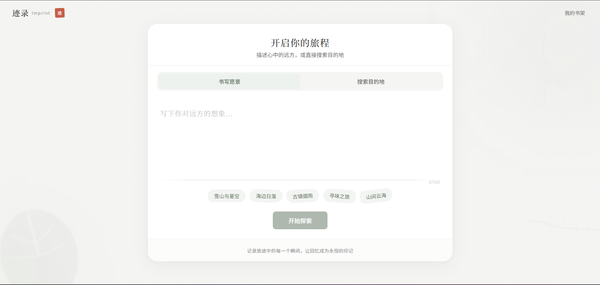
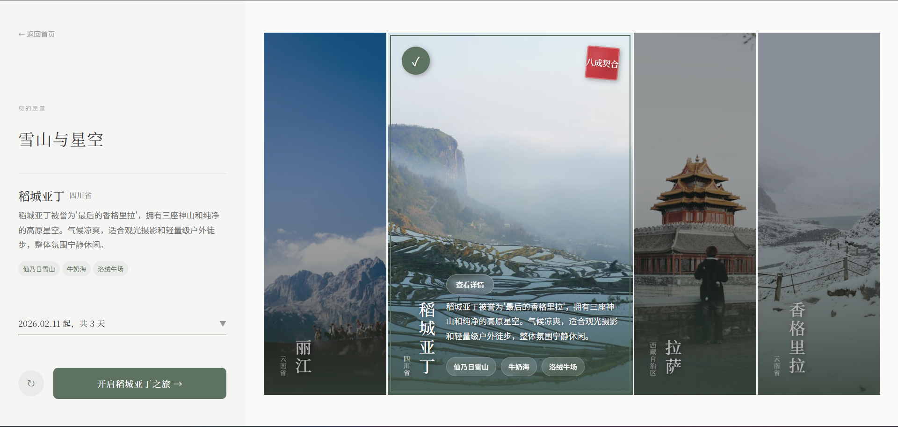
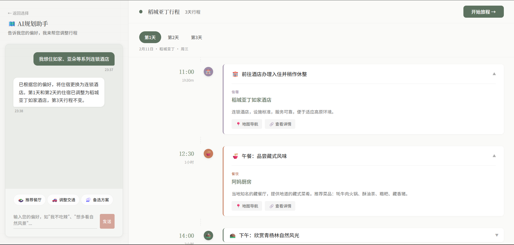
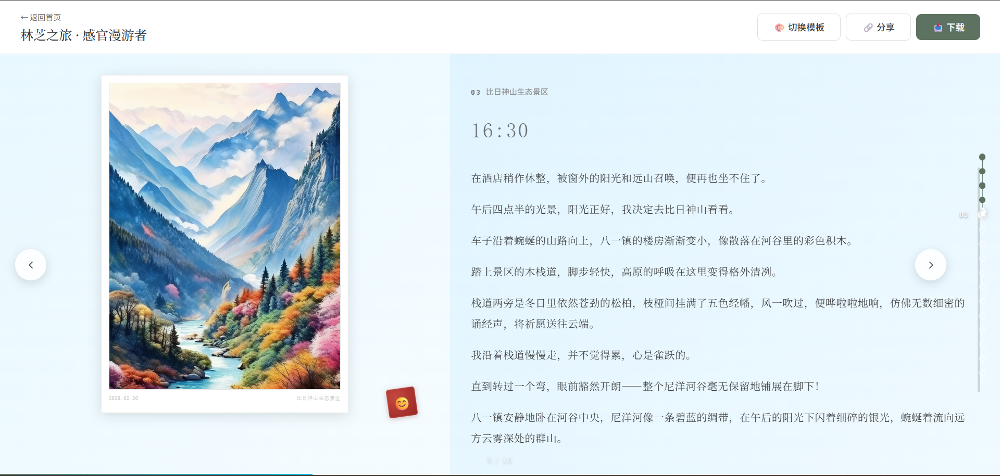
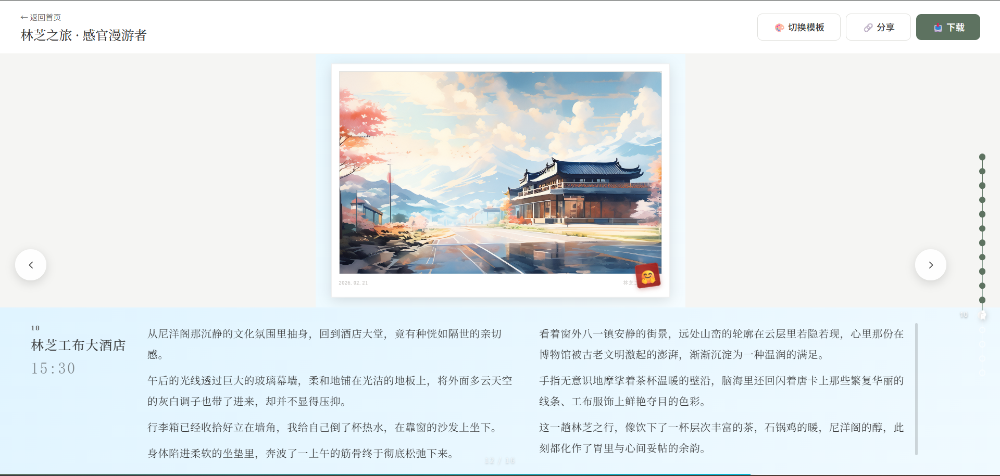
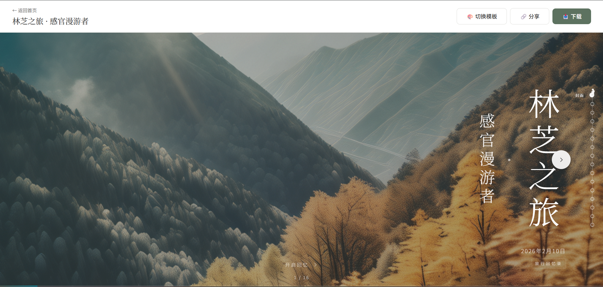
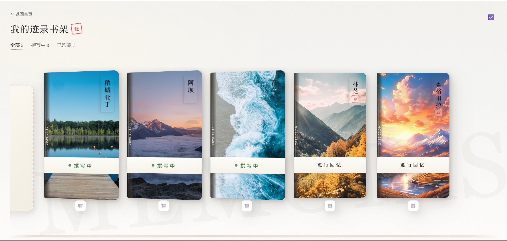

# Imprint 迹录 - AI 旅行日记系统

一个基于 AI 的智能旅行规划和日记生成系统。用户可以通过自然语言描述旅行愿景，系统会自动推荐目的地、生成行程规划，并在旅行过程中帮助记录和生成精美的旅行回忆录。

## 📸 界面展示

<p align="center">
  
  
</p>
<p align="center">
  
  
</p>
<p align="center">
  
  
</p>
<p align="center">
  
  
</p>

## ✨ 功能特点

- 🎯 **愿景分析** - 通过自然语言理解用户的旅行期望
- 🌍 **智能推荐** - AI 驱动的目的地推荐，配有精美封面图
- 📅 **行程规划** - 对话式行程生成与调整，支持拖拽排序
- 📸 **日记记录** - 支持照片上传、语音录制、文字记录
- 🤖 **AI 日记生成** - 基于用户素材自动生成文学化日记
- 🎨 **AI 配图** - 无照片时自动生成水彩风格配图
- 📖 **回忆录生成** - 自动生成精美的旅行回忆录，含旅行人格分析
- 📚 **迹录书架** - 手账式书籍风格的旅行记录管理

## 🛠 技术栈

- **后端**: Node.js + Express + TypeScript + SQLite (better-sqlite3)
- **前端**: React 18 + TypeScript + Vite + React Router
- **AI 服务**: 
  - DeepSeek (文本生成)
  - 通义千问 Qwen-VL (图像理解)
  - 通义万相 Wanx (图像生成)
- **外部 API**: 
  - Unsplash (目的地封面图)
  - 高德地图 (POI 搜索)
  - Tavily (信息验证)
- **存储**: 阿里云 OSS (可选，用于图片云存储)

## 📋 环境要求

- Node.js >= 18.0.0
- npm >= 8.0.0

## 🚀 快速开始

### 1. 克隆项目

```bash
git clone <repository-url>
cd ai-travel-planner
```

### 2. 安装依赖

```bash
npm install
```

### 3. 配置环境变量

复制后端环境变量模板：

```bash
# Windows
copy backend\.env.example backend\.env

# macOS/Linux
cp backend/.env.example backend/.env
```

编辑 `backend/.env` 文件，配置 API 密钥（详见下方 API 配置指南）。

### 4. 启动开发服务器

**方式一：同时启动前后端**

```bash
npm run dev
```

**方式二：分别启动**

```bash
# 终端 1 - 启动后端 (端口 3000)
npm run dev:backend

# 终端 2 - 启动前端 (端口 5173)
npm run dev:frontend
```

### 5. 访问应用

打开浏览器访问 `http://localhost:5173`

---

## 🔑 API 配置指南

在 `backend/.env` 中配置以下 API 密钥：

### 必需配置

#### DeepSeek API ⭐ 必需

用于：愿景分析、目的地推荐、行程规划、日记生成、回忆录生成

```env
DEEPSEEK_API_KEY=your_deepseek_api_key_here
DEEPSEEK_BASE_URL=https://api.deepseek.com
DEEPSEEK_MODEL=deepseek-chat
```

**获取方式：**
1. 访问 [DeepSeek 开放平台](https://platform.deepseek.com/)
2. 注册账号并登录
3. 在控制台创建 API Key

---

### 可选配置

#### 通义千问 Qwen-VL API

用于：照片内容分析（无配置时使用文件名作为描述）

```env
QWEN_VL_API_KEY=your_qwen_vl_api_key_here
QWEN_VL_BASE_URL=https://dashscope.aliyuncs.com/api/v1
```

#### 通义万相 Wanx API

用于：生成回忆录封面图、无照片时生成 AI 配图

```env
WANX_API_KEY=your_wanx_api_key_here
WANX_BASE_URL=https://dashscope.aliyuncs.com/api/v1
WANX_MODEL=wanx-v1
```

> 💡 `WANX_MODEL` 可选值：`wanx-v1`（便宜）或 `wanx2.1-t2i-turbo`（质量更高）

**获取方式（Qwen-VL 和 Wanx 共用）：**
1. 访问 [阿里云 DashScope](https://dashscope.aliyun.com/)
2. 开通 DashScope 服务
3. 创建 API Key（两个服务可共用同一个 Key）

#### 阿里云 OSS

用于：图片云存储（启用后支持 AI 图像分析，无配置时使用本地存储）

```env
OSS_REGION=oss-cn-hangzhou
OSS_ACCESS_KEY_ID=your_oss_access_key_id
OSS_ACCESS_KEY_SECRET=your_oss_access_key_secret
OSS_BUCKET=your_bucket_name
```

**获取方式：**
1. 访问 [阿里云 OSS 控制台](https://oss.console.aliyun.com/)
2. 创建 Bucket（建议选择公共读权限）
3. 在 RAM 访问控制中创建 AccessKey

#### Unsplash API

用于：目的地封面图（无配置时使用默认图片）

```env
UNSPLASH_ACCESS_KEY=your_unsplash_access_key_here
UNSPLASH_ENABLED=true
```

**获取方式：**
1. 访问 [Unsplash Developers](https://unsplash.com/developers)
2. 注册开发者账号
3. 创建应用获取 Access Key

#### 高德地图 API

用于：POI 搜索、地点信息获取

```env
AMAP_API_KEY=your_amap_api_key_here
```

**获取方式：**
1. 访问 [高德开放平台](https://console.amap.com/dev/key/app)
2. 注册并创建应用
3. 获取 Web 服务 API Key

#### Tavily API

用于：行程节点信息验证

```env
TAVILY_API_KEY=your_tavily_api_key_here
```

**获取方式：**
1. 访问 [Tavily](https://tavily.com/)
2. 注册账号获取 API Key

---

### 完整配置示例

```env
# 服务器配置
PORT=3000
NODE_ENV=development

# 数据库配置
DATABASE_PATH=./data/travel-planner.db

# 文件存储配置
STORAGE_PATH=./uploads

# ========== 必需 ==========
# DeepSeek API
DEEPSEEK_API_KEY=sk-xxxxxxxxxxxxxxxx
DEEPSEEK_BASE_URL=https://api.deepseek.com
DEEPSEEK_MODEL=deepseek-chat

# ========== 可选 ==========
# 阿里云 OSS (推荐配置，启用 AI 图像分析)
OSS_REGION=oss-cn-hangzhou
OSS_ACCESS_KEY_ID=LTAI5txxxxxxxxxx
OSS_ACCESS_KEY_SECRET=xxxxxxxxxxxxxxxx
OSS_BUCKET=my-travel-bucket

# 通义千问视觉版 (照片分析)
QWEN_VL_API_KEY=sk-xxxxxxxxxxxxxxxx
QWEN_VL_BASE_URL=https://dashscope.aliyuncs.com/api/v1

# 通义万相 (AI 配图)
WANX_API_KEY=sk-xxxxxxxxxxxxxxxx
WANX_BASE_URL=https://dashscope.aliyuncs.com/api/v1
WANX_MODEL=wanx-v1

# Unsplash (目的地封面)
UNSPLASH_ACCESS_KEY=xxxxxxxxxxxxxxxx
UNSPLASH_ENABLED=true

# 高德地图 (POI 搜索)
AMAP_API_KEY=xxxxxxxxxxxxxxxx

# Tavily (信息验证)
TAVILY_API_KEY=tvly-xxxxxxxxxxxxxxxx
```

---

## 📁 项目结构

```
ai-travel-planner/
├── backend/                    # 后端服务
│   ├── src/
│   │   ├── clients/           # 外部 API 客户端
│   │   │   ├── deepseekClient.ts    # DeepSeek 文本生成
│   │   │   ├── qwenVLClient.ts      # 通义千问图像理解
│   │   │   ├── wanxClient.ts        # 通义万相图像生成
│   │   │   ├── unsplashClient.ts    # Unsplash 图片
│   │   │   ├── amapClient.ts        # 高德地图
│   │   │   ├── tavilyClient.ts      # Tavily 搜索
│   │   │   └── ossClient.ts         # 阿里云 OSS
│   │   ├── database/          # 数据库
│   │   │   ├── index.ts             # 数据库初始化
│   │   │   └── schema.sql           # 表结构定义
│   │   ├── routes/            # API 路由
│   │   │   ├── tripRoutes.ts        # 旅程管理
│   │   │   ├── destinationRoutes.ts # 目的地推荐
│   │   │   ├── itineraryRoutes.ts   # 行程规划
│   │   │   ├── diaryRoutes.ts       # 日记管理
│   │   │   ├── memoirRoutes.ts      # 回忆录生成
│   │   │   └── visionRoutes.ts      # 图像分析
│   │   ├── services/          # 业务逻辑
│   │   └── storage/           # 文件存储
│   ├── data/                  # SQLite 数据库文件
│   ├── uploads/               # 上传文件存储
│   │   ├── photos/           # 照片
│   │   └── audio/            # 语音录音
│   ├── .env.example          # 环境变量模板
│   └── package.json
├── frontend/                  # 前端应用
│   ├── src/
│   │   ├── api/              # API 调用封装
│   │   ├── components/       # React 组件
│   │   │   ├── Button/             # 按钮
│   │   │   ├── Card/               # 卡片
│   │   │   ├── ChatPanel/          # 对话面板
│   │   │   ├── CitySearch/         # 城市搜索
│   │   │   ├── DestinationCard/    # 目的地卡片
│   │   │   ├── DiaryFragment/      # 日记片段
│   │   │   ├── ItineraryBoard/     # 行程看板
│   │   │   ├── MemoirViewer/       # 回忆录查看器
│   │   │   ├── NodeRecorder/       # 节点记录器
│   │   │   └── ...
│   │   ├── pages/            # 页面组件
│   │   │   ├── HomePage.tsx        # 首页 - 愿景输入
│   │   │   ├── DestinationPage.tsx # 目的地选择
│   │   │   ├── PlanningPage.tsx    # 行程规划
│   │   │   ├── TravelingPage.tsx   # 旅行记录
│   │   │   ├── MemoirPage.tsx      # 回忆录查看
│   │   │   └── HistoryPage.tsx     # 迹录书架
│   │   ├── types/            # TypeScript 类型定义
│   │   └── App.tsx           # 应用入口
│   └── package.json
└── package.json              # 根配置 (workspaces)
```

---

## 📜 可用脚本

```bash
# 开发
npm run dev              # 同时启动前后端
npm run dev:backend      # 仅启动后端 (端口 3000)
npm run dev:frontend     # 仅启动前端 (端口 5173)

# 构建
npm run build:backend    # 构建后端
npm run build:frontend   # 构建前端

# 测试
npm run test:backend     # 运行后端测试
npm run test:frontend    # 运行前端测试

# 代码质量
npm run lint             # ESLint 检查
npm run format           # Prettier 格式化
```

---

## 🎮 使用流程

### 1. 输入愿景
在首页输入你的旅行愿望，如"想去一个有海的地方放松一周"

### 2. 选择目的地
系统推荐 3 个目的地，可以"换一批"或直接选择心仪的城市

### 3. 规划行程
通过对话调整 AI 生成的行程，支持：
- 拖拽排序调整顺序
- 手动编辑节点内容
- 对话式修改（如"把第二天的行程改轻松一点"）

### 4. 开始旅行
进入旅行模式，在每个节点：
- 📷 上传照片
- 🎤 录制语音
- ✏️ 输入文字
- 点击"点亮"生成 AI 日记

### 5. 生成回忆录
旅行结束后：
- 自动生成精美回忆录
- 包含旅行人格分析
- 可选择不同模板风格
- 支持分享和下载

### 6. 迹录书架
所有旅行记录以日式书籍风格展示，支持：
- 筛选查看（全部/撰写中/已珍藏）
- 批量管理
- 继续编辑未完成的旅行

---

## 📄 License

MIT
